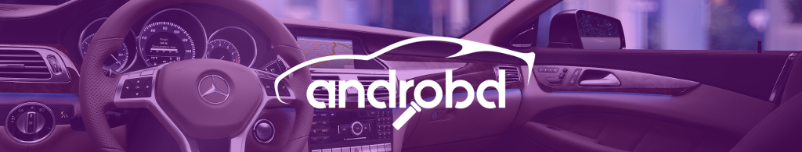

AndrOBD allows your Android device to connect to your car's on-board diagnostics system via any ELM327 compatible OBD adapter, display various information & perform operations.
It is open source and completely free. The application also has a built in Demo mode that simulates live data, so you don't require an adapter to test it.

## Documentation

* [FAQ](https://github.com/fr3ts0n/AndrOBD/wiki/Frequently-asked-questions) - Frequently asked questions

* [Wiki](https://github.com/fr3ts0n/AndrOBD/wiki) - AndrOBD knowledge database

## Install

##  Features

#### Connection types
* Bluetooth
* USB
* Wi-Fi

#### Functionality

* Read fault codes
* Clear fault codes
* Read/record live data
* Read freeze frame data
* Read vehicle info data

  
Expand features list

  
#### Additional features

* Day/Night view
* Data charts
* Dashboard
* Head up display
* Save recorded data
* Load recorded data (for analysis)
* CSV export

#### Customisation of PID data

* PID data items
* Data conversions

#### Plugin extension support

* Development: [AndrOBD-Plugin repository](https://github.com/fr3ts0n/AndrOBD-Plugin)
* Available Plugins:
  * [MQTT publisher](https://f-droid.org/en/packages/com.fr3ts0n.androbd.plugin.mqtt/) - Publish OBD data to MQTT broker
  * [GpsProvider](https://f-droid.org/en/packages/com.fr3ts0n.androbd.plugin.gpsprovider/) - Provide GPS data to AndrOBD
  * [SensorProvider](https://f-droid.org/en/packages/com.fr3ts0n.androbd.plugin.sensorprovider/) - Provide Accelerometer data to AndrOBD

#### Native language support
 
* translatable via [weblate.org](https://hosted.weblate.org/engage/androbd/)
  * [Program dialogs](https://hosted.weblate.org/projects/androbd/strings/)
  * [OBD data descriptions](https://hosted.weblate.org/projects/androbd/obd-data-descriptions/)
  * [Fault code descriptions](https://hosted.weblate.org/projects/androbd/fault-codes/)

## Screenshots

| Functions | OBD data | Dashboard |
| :--: | :--: | :--: |
|  |  |  |

*More screenshots available on [the Website](https://fr3ts0n.github.io/AndrOBD/) or in the [Screenshots folder](https://github.com/fr3ts0n/AndrOBD/tree/master/fastlane/metadata/android/en-US/images/phoneScreenshots)*

## Contribute
  * Report issues in the [issue tracker](https://github.com/fr3ts0n/AndrOBD/issues)
  * Create a [Pull Request](https://docs.github.com/en/pull-requests)
  * Test the app with different devices, alpha & beta releases are posted in the Telegram [AndrOBD release channel](https://t.me/AndrOBD_dev)
  * Contribute to development of plugin extensions: [AndrOBD-Plugin repository](https://github.com/fr3ts0n/AndrOBD-Plugin)
  * Discuss the project in the [Telegram](https://t.me/joinchat/G60ltQv5CCEQ94BZ5yWQbg) or [Matrix](https://matrix.to/#/#AndrOBD:matrix.org) chat rooms
  * Translate this app into more languages on [Weblate](https://hosted.weblate.org/engage/androbd/), or have a look at [Language translation](https://github.com/fr3ts0n/AndrOBD/wiki/Language-translation) section in the Wiki for more info.

  
Expand translation status

#### App dialogs:

#### OBD data descriptions:

#### Fault codes:

#### Plugin framework:

 
#### ⚠️ Design request ⚠️
* AndrOBD is looking for help with designing and implementing of a new modern GUI ([#104](https://github.com/fr3ts0n/AndrOBD/issues/104), [#126](https://github.com/fr3ts0n/AndrOBD/issues/126)), *Java & Kotlin [can be used](https://github.com/fr3ts0n/AndrOBD/wiki/Frequently-asked-questions#what-programming-languages-can-be-used-for-contributions)*. Contributers will be credited/linked in the Readme.

## Support by donating

Buy us a coffee or donate in the amount that you see valuable for the project, as it will enable us to put more free time into the active development.

<table>
  <tr>
    <th colspan="3">Thank you for donating</th>
  </tr>
  <tr>
    <td align="center"></td>
    <td align="center">PayPal</td>
    <td><a href="https://www.paypal.me/fr3ts0n">https://www.paypal.me/fr3ts0n</a></td>
  </tr>
  <tr>
    <td align="center">
      
    </td>
    <td align="center">Liberapay</td>
    <td>
      <a href="https://liberapay.com/AndrOBD/donate/">https://liberapay.com/AndrOBD/donate</a>
    </td>
  </tr>
  <tr>
    <td align="center"></td>
    <td align="center">Bitcoin</a></td>
    <td><a href="bitcoin:19UApzsc5eDJ5VNDNYCA1bpszPnkcpWeFP">19UApzsc5eDJ5VNDNYCA1bpszPnkcpWeFP</a></td>
  </tr>
</table>

#### Credits

  
Donators

&nbsp;
  
| Date | Supporter | Donation  |
|------|-----------|----------:|
| 2018/02 | John Zimmerer | $10 |
| 2018/12 | Martin Bourdoiseau | €20 |
| 2019/06 | Jeffrey O'Connell | $10 |
| 2019/08 | Christoph Schmid | €10 |
| 2020/01 | Glenn Fowler | $5 |
| 2020/02 | Klemen Skerbiš | €5 |
| 2020/06 | Jairus Martin | $10 |
| 2020/06 | rusefi llc | €25 |
| 2020/07 | Klemen Skerbiš | €5 |
| 2020/10 | Frank White | $8 |
| 2021/03 | Raphael Högger | CHF60 |
| 2021/04 | Klemen Skerbiš | €5 |
| 2021/06 | Christoph Goetz | €5 |
| 2021/11 | Raphael Högger | CHF60 |
| 2022/05 | Cecil Harper | €6 |
| 2022/07 | Daniel Singh | $10 |
| 2022/09 | Andrew Hofmans | €5 |
| 2022/11 | Glenn Fowler | $5 |
| 2023/01 | Remy Piper | €10 |
| 2023/03 | Hausmeister0815 | $60 |
| 2023/07 | Christian Böttcher | €10 |
| 2023/11 | @user8446 | $10 |
| 2024/01 | Hausmeister0815 | €50 |
| 2024/04 | @BaderSZ | $5 |
| 2024/05 | Raphael Högger | CHF52 |
| 2024/11 | @user8446 | $10 |

  
Contributors

  
#### Graphic design

* Very special Thanks to [anaufalm](https://github.com/anaufalm) for the [beautiful graphic design artwork and logos](https://steemit.com/utopian-io/@naufal/my-design-logo-for-androbd-valid-commit-and-added-to-v2-0-3).

#### Start page

* Thank you very much [sampoder](https://github.com/sampoder/) for a beautiful [AndrOBD start page](https://fr3ts0n.github.io/AndrOBD/).

#### Internet promotion

* Big hands to [aha999](https://github.com/aha999/) for a fancier Readme, community help and many ideas to improve AndrOBD.

#### Hosting translations

* Special thanks to [Michal Čihař](https://github.com/nijel) for hosting translations on [weblate.org](http://weblate.org/).

*Thanks to the open source community and any supporters who pick this project up, AndrOBD will be able to get more development, new features, and hopefully even more than that.*
